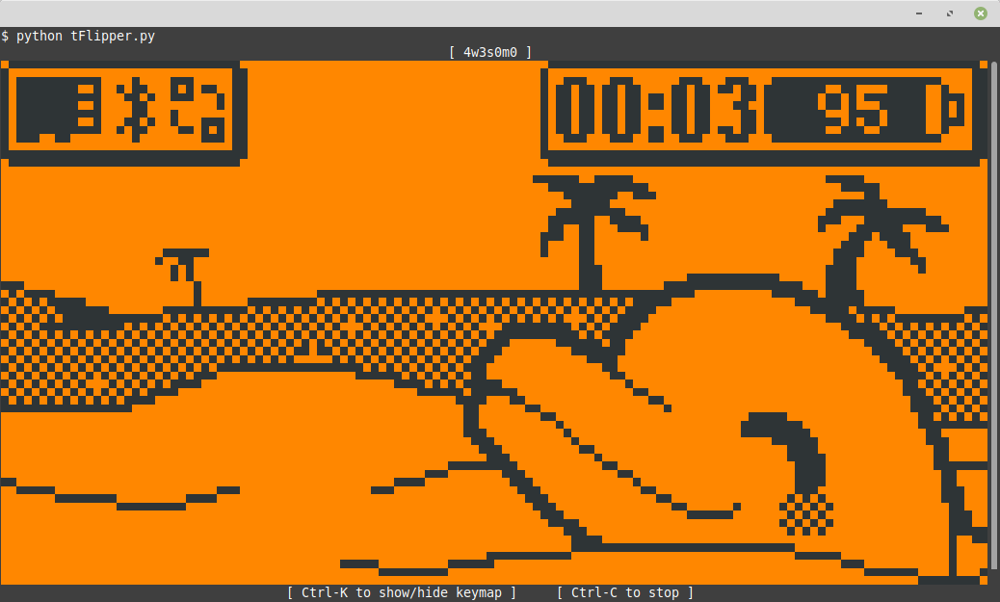
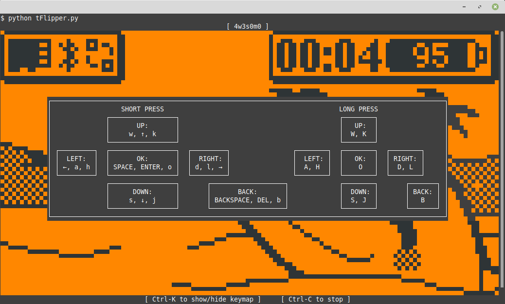
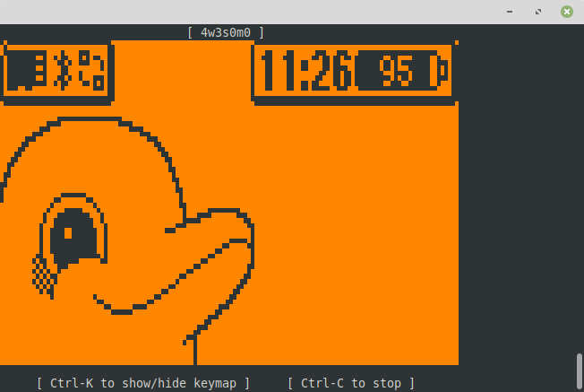

# Flipper Zero console remote control
### Version 1.0.0

* [Usage](#Usage)
* [Installation](#Installation)
* [License](#License)

Text-mode [Flipper Zero](https://flipperzero.one/) remote-control.

#### Functions

- Display the Flipper Zero's screen in the console in real time
- Send button presses from the keyboard

just like the remote control in [qFlipper](https://docs.flipper.net/qflipper), but in text mode.

https://github.com/Giraut/tFlipper/assets/37288252/fdbd40c5-2450-4179-8eb8-e7baae83322f


## Usage

- Connect the Flipper Zero to a USB port
- Open a terminal
- Invoke `python tFlipper.py`

The utility connects to the Flipper Zero and start displaying its screen in the console.



Hit `Ctrl-K` to see the keyboard-to-buttons mapping. To remain compatible with most terminals, the keyboard input uses separate keys to emulate short and long Flipper Zero button presses.



If you invoke `python tFlipper.py -H`, the display will be rendered using high-density semigraphics: the entire display will then fit in a 80 x 24 console, at the cost of a slightly distorted image, because the aspect ratio cannot be respected:




## Installation

- Install [Python 3](https://www.python.org/)
- Install the following modules:

    ```
    $ python -m pip install flipperzero_protobuf
    $ python -m pip install readchar
    ```

- In Windows, you also need to install:

    ```
    $ python -m pip install colorama
    ```

- Clone this repository
- Copy the `tFlipper.py` file anywhere you find convenient in the executable path


## License

MIT
