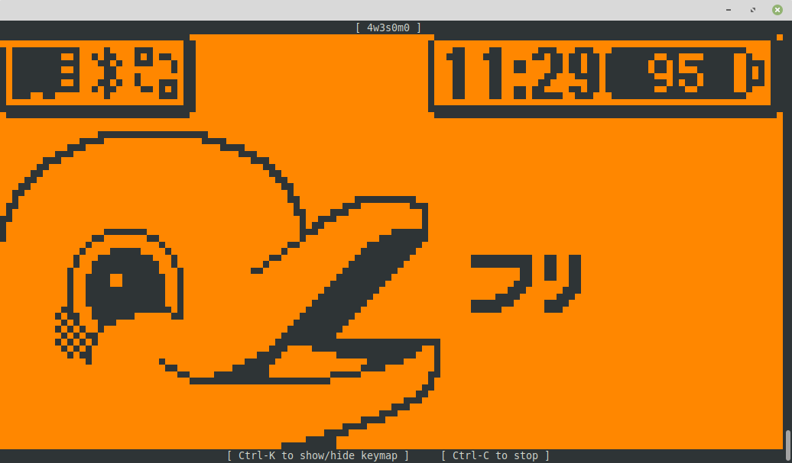
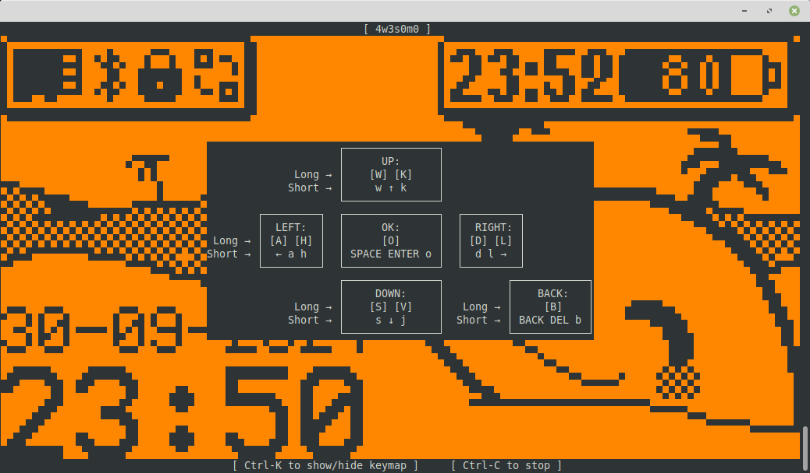
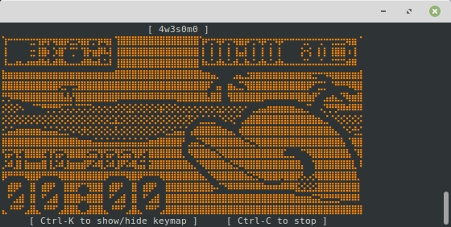

# Flipper Zero console remote control
### Version 1.6.1

* [Usage](#Usage)
* [Installation](#Installation)
* [License](#License)

Text-mode [Flipper Zero](https://flipperzero.one/) remote-control.

#### Functions

- Display the Flipper Zero's screen in the console in real time
- Send button presses from the keyboard
- Record and replay a screen session
- Record and replay button presses

https://github.com/Giraut/tFlipper/assets/37288252/dff3fa2c-835d-40c3-ad4f-d5bc8a89916e


## Usage

- Connect the Flipper Zero to a USB port
- Open a terminal
- Run `python tflipper.py`

The utility connects to the Flipper Zero and displays its screen in the console.



Hit `Ctrl-K` to see the keyboard-to-buttons mapping. To remain compatible with most terminals, the keyboard input uses separate keys to emulate short and long Flipper Zero button presses.



- Run `python tflipper.py -H` to render the display using high-density semigraphics: the entire display will then fit in a 80 x 24 console, at the cost of a slightly distorted image, because the aspect ratio cannot be respected:



- Run `python tflipper.py -t session.txt` to record the session as ANSI text in `session.txt`, including timing markers and button press events:
  - The screen session can be replayed with the correct timing with `python tfreplay.py session.txt`
  - The button presses can be replayed on the Flipper zero with `python tflipper.py -rt session.txt`

- Run `python tflipper.py -g session.gif` to record the session as an animated GIF in `session.gif`, including timing markers and button press events:
  - The animated GIF can be replayed using most image viewers, video players and web browsers
  - The button presses can be replayed on the Flipper zero with `python tflipper.py -rg session.gif`

      

- Run `python tflipper.py -n` to suppress the normal display output and only print button press events (also works when replaying them from a text or GIF file):

    ```
    $ python tflipper.py -n
    [3.943s] ↰
    [3.943s] ↰
    [3.943s] ↰
    [7.099s] o
    [10.404s] →
    [11.730s] ↓
    [12.675s] ↓
    [13.231s] ↓
    [16.166s] ↰
    [20.519s] o (long press)
    [22.855s] o (long press)
    [26.734s] ← (long press)
    ```

## Installation

- Install [Python 3](https://www.python.org/)
- Install the following modules:

    ```
    $ python -m pip install flipperzero-protobuf
    $ python -m pip install readchar
    $ python -m pip install Pillow
    ```

- In Windows, you also need to install:

    ```
    $ python -m pip install colorama
    ```

- Clone this repository
- Copy `tflipper.py` and `tfreplay.py` anywhere you find convenient in the executable path


## License

MIT
